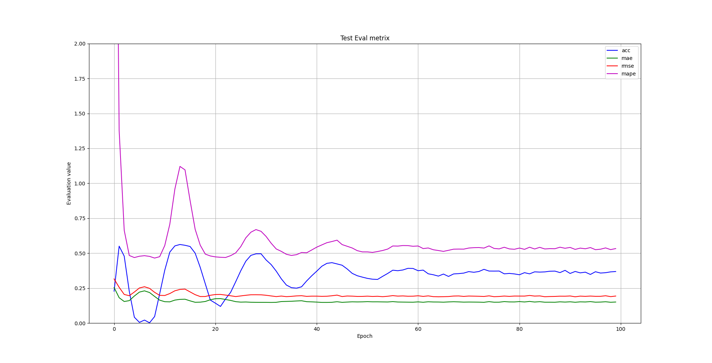
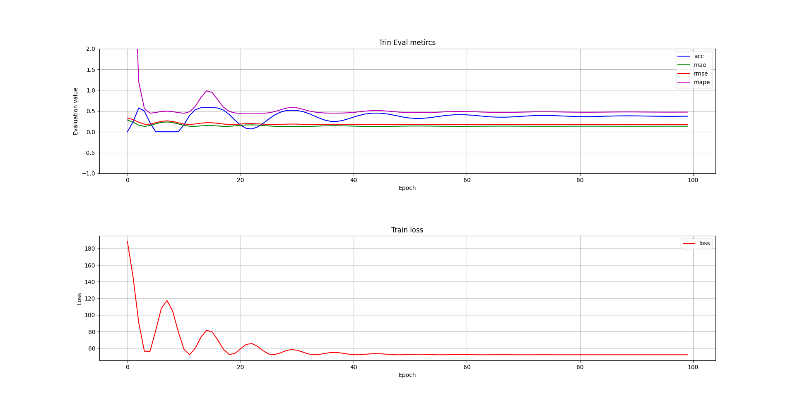

# Adanvanced Algorithm

张心亮，2021244024

## Data Pre-processing

First, organise the dataset in like the following tree:
```py
├─PRSA2017_Data_20130301-20170228
    ├─PRSA_Data_Aotizhongxin_20130301-20170228.csv
    ├─PRSA_Data_Changping_20130301-20170228.csv
    ├─PRSA_Data_Dingling_20130301-20170228.csv
    ├─PRSA_Data_Dongsi_20130301-20170228.csv
    ├─PRSA_Data_Guanyuan_20130301-20170228.csv
    ├─PRSA_Data_Gucheng_20130301-20170228.csv
    ├─PRSA_Data_Huairou_20130301-20170228.csv
    ├─PRSA_Data_Nongzhanguan_20130301-20170228.csv
    ├─PRSA_Data_Shunyi_20130301-20170228.csv
    ├─PRSA_Data_Tiantan_20130301-20170228.csv
    ├─PRSA_Data_Wanliu_20130301-20170228.csv
    └─PRSA_Data_Wanshouxigong_20130301-20170228.csv
```

Then run the dataset code: ```python split_data.py --file PRSA2017_Data_20130301-20170228\PRSA_Data_Changping_20130301-20170228.csv```, the dataset will be splited by stations, years and seasons in folder ```split```.
To make it easy, a bash command is provided:
```sh
sh split.sh
```
And the folder looks like:
```py
├─split
  ├─Aotizhongxin
    ├─2013_season1.csv
    ├─2013_season2.csv
    ├─2013_season3.csv
    ├─ ...
  ├─Changping
  ├─Dingling
  ├─Dongsi
  ├─Guanyuan
  ├─Gucheng
  ├─Huairou
  ├─Nongzhanguan
  ├─Shunyi
  ├─Tiantan
  ├─Wanliu
  └─Wanshouxigong
```

## Linear regression

### Regular Linear regression

To use linear regression to fit one season, the following code is an example:

```python regression.py --file split\\Aotizhongxin\\2013_season1.csv --mode 0```

which ```--mode 0``` means use regular linear regression.

The result is recorded in ```experiment\Linear\record.csv```

To generate the result in report, run the bash:
```sh
sh linear.sh
```

### None Linear regression

To use none linear regression to fit one season, the following code is an example:

```python regression.py --file split\\Aotizhongxin\\2014_season3.csv --mode 1```

which ```--mode 1 ``` means use SVM to fit the dataset.

The result is recoreded in ```experiment\SVR\record.csv```

To generate the result in report, run the bash:
```sh
sh svr.sh
```

### DNN regression

#### Useage
In this project, I use a MLP to fit the dataset, which is written in pure python without using open-source framework.

The default setting in this DNN is a 3-layer DNN, whose architecture is:

```py
    model = Network()
    model.add(Linear('fc1', 5, 256, 0.001))
    model.add(Tanh('tanh1'))
    model.add(Linear('fc2',256,128,0.001))
    model.add(Tanh('tanh2'))
    model.add(Linear('fc3',128,1,0.001))
    model.train()
```
The training config ```config.yml``` is in config folder.
Run :
```py
python mydnn.py --file split\\Aotizhongxin\\2014_season1.csv --log_dir log\\3_layer_tanh
```
And the code will save the results in ```log\\3_layer_tanh``` with files: ```test.log``` and ```train.log```


#### Visulization for results.

Suppose you have run the training code, and the log files is generated in ```log\\3_layer_tanh``` folder.
Run:
```py
python plot.py --log log\\3_layer_tanh\\test.log --mode test
python plot.py --log log\\3_layer_tanh\\train.log --mode train
```

The visulization of the evaluation metrics will be generated.



